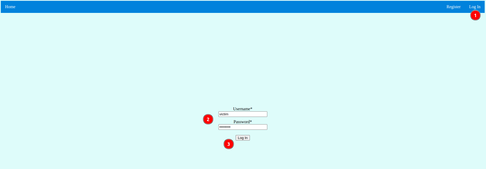
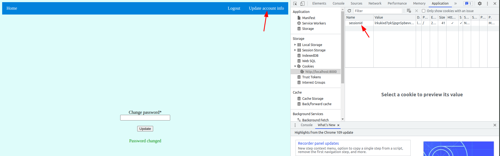
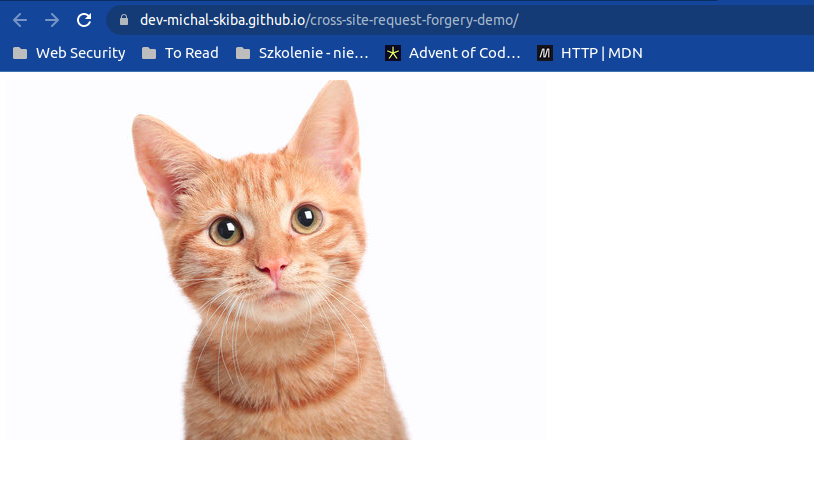
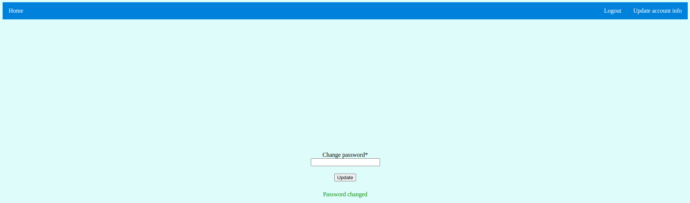
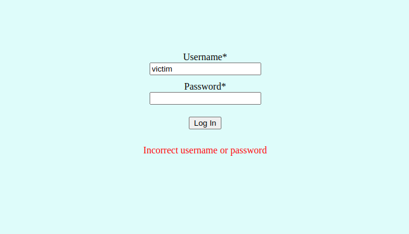
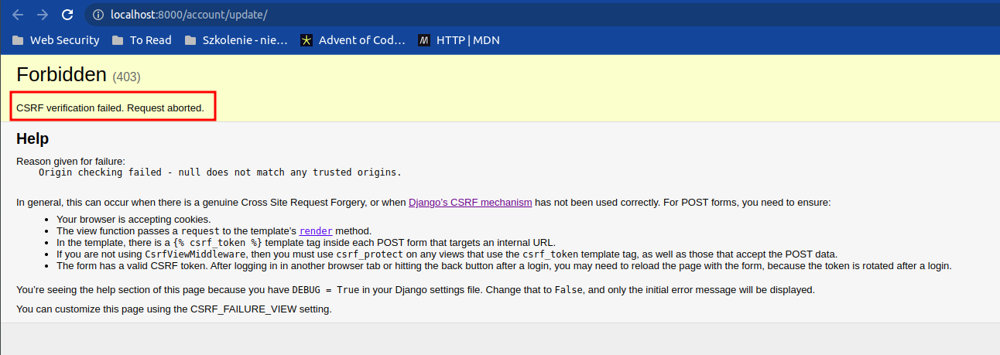
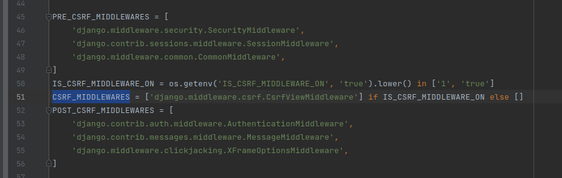
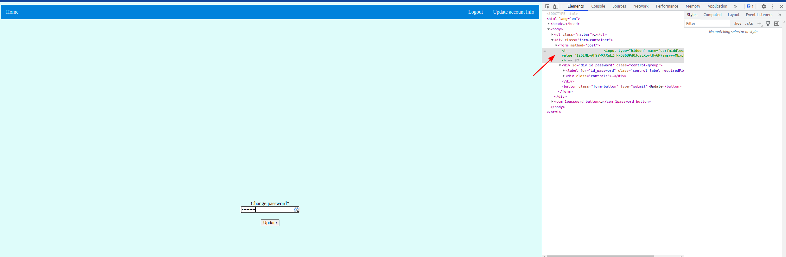
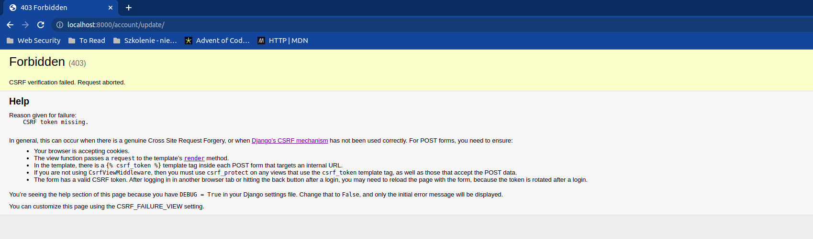

# 1. Introduction
This project is focused on showing one of the cybersecurity attack: cross site request forgery(CSRF),
so other vulnerabilities like not using ssl certificates, etc. are not considered.

# 2. What is a CSRF attack
Resource: https://cheatsheetseries.owasp.org/cheatsheets/Cross-Site_Request_Forgery_Prevention_Cheat_Sheet.html

Cross-Site Request Forgery (CSRF) is a type of attack that occurs when a malicious website, email,
blog, instant message, or program causes a user's web browser to perform an unwanted action
on a trusted site when the user is authenticated. A CSRF attack works because browser requests
automatically include all cookies including session cookies. Therefore, if the user is
authenticated to the site, the site cannot distinguish between legitimate authorized requests and
forged authenticated requests. This attack is thwarted when proper Authorization is used, which
implies that a challenge-response mechanism is required that verifies the identity and authority
of the requester

# 3. What are the preventions for the CSRF attack
First thing to prevent CSRF attack should be setting `SameSite` parameter on session cookie
either to `Strict` or `Lax`. The first one will include cookie only for requests originated from
the same origin. It means that any links to the site you are already logged in from conversations,
other sites or emails will take yo to the site, but you will not be logged in, which is not the best
user experience. `Lax` is better option, because it passes the cookie for unsafe methods
(`GET` for example). That is why when someone gives you link to GitHub repository
(assuming that on current session you are already logged in on GitHub) you will be logged in when
site is loaded. In case of CSRF attack `Lax` will do the job, because it will not pass the session
cookie when malicious website will try to use your session to send safe request
(`POST`, `PUT`, `DELETE`, etc). The origin of malicious website is different from your website
and cookie will not be passed.

Setting `SameSite` attribute is not considered to be sufficient for preventing CSRF attack.
Exploits for `SameSite=Lax` set by default by browsers are known
([link to resource](https://pulsesecurity.co.nz/articles/samesite-lax-csrf)).
To ensure CSRF prevention, it is recommended to use CSRF token. There are two ways of implementing
CSRF token(which are described below), but of the ways follows the same base principles. Token
is generated on server side and then send to the client. When client wants to send request using
safe method it needs to provide CSRF token which is then validated on server side.

## 3.1. Double Submit Cookie
The idea of Double Submit Cookie is that token is generated by server and set as a cookie on the
client side. The cookie cannot be HTTP only. When sending safe request, client will include
the CSRF token both in cookie (attached automatically by browser) and in request body
(hidden field on form for example). It ensures that token was read by the site from cookie
and double confirmed in request body. Server only confirms that tokens in cookie and in body
are the same. When malicious website will try to send request to the website, it will only attach
token in cookie(assuming session and CSRF cookies are using `SameSite=None`).
Malicious website has no way of reading the cookie as long as the site has no XSS or
man in the middle vulnerability.

## 3.2. Synchronizer Token Pattern
The idea of Synchronizer Token Pattern is slightly different. CSRF token is generated by server
and stored on server side. It is sent to the client in the response payload. When sending safe
request, client will include the CSRF token only in request body(hidden field on form for example).
Then, token sent by client is compared with token stored on server side which is connected to user
session. In this pattern, server cannot set CSRF token as a cookie. There is risk that malicious
website will try to send request to the website and CSRF token will be passed with this request
which is sufficient for successful attack in this pattern.

# 4. Local setup for demo

## 4.1. Requirements
- Docker version 20.10.18
- docker-compose version 1.29.2
Project was developed with these versions of docker, but previous versions should also work.

## 4.2. Steps

1. Download this repository
2. Run `./bin/build_image` which downloads and builds required docker image(it may take a moment)
3. Run `./bin/run_app` which builds database and starts Django monolith application.
It may need rerun after first time, because of db building while backend depends on it.
4. Run `./bin/load_demo_data` to load demo data.
5. Create `.env` file in repository root with `IS_CSRF_MIDDLEWARE_ON=false`

Now app should be accessible at http://localhost:8000.

# 5. Demo scenario

## Login to victim account
Login to the page with following credentials:
- username: `victim`
- password `Demo1234!`

## Get familiar with change password functionality
There is ordinary change password form on the site. By filling new password and clicking update
you can change your password. You can try changing password, logging out and logging in to check
that it works. For the next step ensure that you are logged in. You can close the page, leave it
on any subpage, just make sure you are logged in(you just have your session cookie set).

## Open exploit site
Let's watch some funny kitties on the internet:
https://dev-michal-skiba.github.io/cross-site-request-forgery-demo/

Oh no, why I was redirected to the CSRF Demo app. Why there is info about my password being
changed?! I think I am the victim of CSRF attack.

## Try to log out and log in with victim account credentials
When you log out and try to log in again you'll see that the password has been indeed changed in
the attack.

## Reload site with CSRF protection and reload demo data
Let's try to reload the site with CSRF protection on. Stop docker containers that run the app.
Change `.env` file to contain `IS_CSRF_MIDDLEWARE_ON=true`. Run app again by executing
`./bin/run_app`. Reload demo data with `./bin/load_demo_data`. Log in to the app with victim
credentials. Make sure you are logged in.

## Open exploit site
Once again you are exhausted after work and you fall for the same malicious website:
https://dev-michal-skiba.github.io/cross-site-request-forgery-demo/. Fortunately this time your
password was not changed. You can scroll internet safely, yay.

There is debug info about CSRF verification failure. On production mode it will rather be some
redirect to the home site or the subpage which educates about CSRF attack.

# 6. So how does it work?

Django uses Double Submit Cookie protection to act against CSRF attacks. Protection is done by
`django.middleware.csrf.CsrfViewMiddleware` which both creates CSRF token on server side, sets it
as a cookie and then validates requests whether it has the same tokens in the cookie and in
the body request. By manipulating `IS_CSRF_MIDDLEWARE_ON` environment variable this middleware is
either included or excluded(see `csrf_demo/settings.py:51`).

It is not efficient to perform CSRF attack on Django app, because session cookie has `SameSite` set
to `Lax` by default. It is also controlled by the environment variable
(see `csrf_demo/settings.py:143`).

Disabling these both protections is sufficient to make your Django app vulnerable to CSRF attack.
It is crucial to leave `CsrfViewMiddleware` in place and to double set CSRF token in form's
hidden field using Django template `csrf_token`. When token is not provided in the form, middleware
will only receive CSRF token in the cookie and it will raise CSRF exception that it cannot compare
tokens and request is rejected.

Let's try it on live example. Comment CSRF token and see what happens when you will try to change
thr password now. Kachoow, CSRF validation works correctly.

